## Summary
We implemented concurrent hash tables with multiple different implementations and compared their performance while tweaking various factors. We implemented a fine-grained hash table, coarse-grained hash table, lockless hash table, and a transactional hash table for use with a restricted transactional memory system. We then compared the performance of each different table while altering the number of threads, range of keys, and ratio of read and write operations. We observed that the lockless implementation is the best, while the coarse-grained hash table performs the worst out of the four. The transactional implementation also outperformed the fine-grained hash table implementation. 

## Background
The key data structure that we use here is a concurrent hash table with chaining for collisions. We don’t attempt to resize the hash table, since we were warned this approach would be too difficult to finish within the scope of our project. As previously mentioned, we have four implementations of concurrent hash tables here: coarse-grained locking, fine-grained locking, lockless, and transactional. Each implementation of the hash table must insert, delete, and find items.

Function signatures:

void HashTable::insertItem(int key, int value)

int *HashTable::findItem(int key)

void HashTable::deleteItem(int key)

insertItem takes a key-value pair and inserts the mapping from the provided key to the provided value into the hash table. findItem takes an input key and returns the value mapped to the key. deleteItem takes an input key and removes the mapping associated with the key from the table if it exists. 
Our performance testing algorithms take in inputs of number of operations, number of threads, range of keys mapped to each index/bucket, and the ratio of read to write operations. The output would be the time taken for the threads to perform all their operations and terminate. 

Hash tables are one of the most important concurrent data structures and have numerous use cases. Since reading and writing to a concurrent hash table can take up the majority of the time in many of these use cases, we attempt to implement and compare different implementations of concurrent hash tables. We are not trying to speedup the usage of a general hash table, but are instead hoping to allow multiple threads to read and write to the same set of data using a key-value store. This, in turn, would allow hash tables to be used as shared memory space for various applications that want to use parallelism to speedup their work. 

There are no real dependencies in the program and the amount of parallelism in the program is up to the user, since we don’t limit the number of threads used. We don’t make use of SIMD in any way and it is also not data-parallel. Locality also doesn’t play a large role in our data structure since chaining is implemented with a linked list instead of an unbounded array. 

## Platform
For the purposes of this project, we tested all our code on Microsoft Azure’s Standard_E2s_v3 machines for consistency and restricted transactional memory support. These machines feature 2.3 GHz Intel XEON ® E5-2673 v4 chips, with support for hyper-threading technology. We chose these machines specifically due to their easy availability and optimization for memory-based operations. 

## Approach

### Coarse-grained
This implementation of the hash table just has one giant lock over the entire hash table. This allows us to ensure correctness of the table itself, but leads to some serious performance issues, which we hope to solve with the other models. Our goal with this table was to set a baseline for how a concurrent hash table would perform, so that we could compare the remainder of our results to it.

### Fine-grained
When two threads are vying for access to the hash table, it may be possible that they are going to modify different buckets in the hash table. This is more likely when there are more number of buckets in the table. In such cases, it does not make sense to have a giant lock over the entire hash table. Instead, we have a lock for each bucket thus eliminating unnecessary waiting time for threads that are operating on different buckets.  

### Lock-free
Lock-free data structures offer various benefits. Firstly they are non-blocking, i.e. it is guaranteed that a finite number of steps taken by a thread ensures progress of some operation unlike using locks wherein if a thread acquires a lock over some shared resource then no other thread can make any progress. Additionally, if a thread that has the lock fails for some reason then this could potentially prevent the other threads waiting on the lock from making any progress. However, implementing lock-free data structures can be quite tricky and ensuring correctness is a major challenge. One of the common problems is the ABA problem that arises because of using compare and exchange operations  to check if next pointer of a node has not changed. Another problem is with the deletion operation. The successor of the node being deleted must not change while the delete is happening. This may happen for instance, while inserting a node after the node to be deleted. What happens is that the predecessor of the node to be deleted ends up pointing to a stale successor. In order to avoid this, <a href="https://timharris.uk/papers/2001-disc.pdf">Harris et al.</a> proposed a two-step  approach wherein they mark the node to be deleted in the first step. At this stage the node is said to be logically deleted and no other nodes can be inserted after this node. In the second step, they physically remove the node from the list. While this method works well, <a href="http://www.cse.yorku.ca/~ruppert/papers/lfll.pdf">Fomitchev et al.</a> pointed out their implementation can be inefficient for the following reason. Suppose a node has to be inserted after node X. At the same time X has been marked for deletion. This means that the node cannot be inserted after X now. So in the implementation of Harris the algorithm would restart the search for a suitable position to insert the node from the start of the list. Fomitchev suggests that each node have an additional attribute called ‘backlink’ which will point to the predecessor of a node if the node is marked for deletion. By doing so, we do not have to restart the search from the start of the list every time. We can traverse the backlink pointers till we reach an unmarked node and resume search from there. But the pitfall here, as highlighted by Fomitchev is that we can end up repeatedly traversing chains of backlinks from left to right while finding a position to insert. In order to avoid this, they introduce an additional flag bit which ensures that long chains of backlinks do not form. How this works is that when a node is to be deleted the predecessor is first flagged. Flagging means that the next pointer of the flagged node cannot be changed and the node cannot be marked for deletion. Once flagging is successful, the node is marked and deleted as before in two steps. Because the predecessor cannot be marked for deletion, long chains of backlinks cannot form. In our implementation, we embed the flag and mark bits in the next pointer of the node and use simple bit masking to extract these bits. We are able to do this because the dynamic memory allocated to nodes is at least 4-byte aligned. Here is an illustration of the 3 step delete proposed by Fomitchev.

Step 1:- Predecessor is flagged

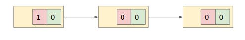

Step 2:- Node to be deleted is marked. Logical delete is said to take place

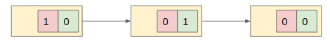

Step 3:- Node to be deleted is physically deleted. Predecessor is unflagged

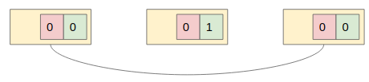

### Transactional Memory
We also explore the possibility using of hardware transactional memory to potentially improve the performance of our hash table while ensuring correctness. To this end, we make use of Intel’s Restricted Transactional Memory (RTM) software interface and in turn, the underlying Transactional Synchronization Extensions (TSX) instructions. This version of transactional memory employs a lazy data-versioning policy, i.e. the changes are made to actual memory locations when the transaction commits and an optimistic conflict detection policy, i.e. the read/write sets are checked for conflicts only at the time of committing the transaction. If a transaction aborts we use our fine-grained lock implementation as a fallback path. In this version of the concurrent hash table, it is important to ensure that the fallback and the transactional paths do not overlap. One of the hazards of not ensuring this is that it is possible that the transaction commit and a write operation in the fallback path occur simultaneously to a memory location which can cause erroneous values to be written. Another potential hazard could arise because the fallback path does not observe writes to a memory location till the transaction commits. Consider a case where two same keys are being inserted by two threads and one of the threads is using the fallback path and the other is using the transactional path. Since the fallback is not aware of the transactional path inserting the same key till the transaction commits, it may be possible that the same key gets inserted twice into our hash table, first by the transactional path and then by the fallback. Clearly, we do not want this in our hash table. We avoid the overlap of the two paths by setting a ‘lockingFlag’ just after acquiring the fine-grained mutex lock in our fallback path. On the other hand, we check if the ‘lockingFlag’ has been set at the start of the transactional section. If it has, we explicitly abort the transaction. But if the ‘lockingFlag’ gets set after this check, the transaction will abort anyway because its readset has been modified. This effectively prevents the overlap of the transactional and fallback paths.

## Results
We analyze the performance of the different versions of our hash table with variation in number of threads, load factor (average number of keys per hash bucket) and the ratio of insert, delete and search operations. Each thread performs 1 million operations in accordance with the insert, delete and search ratios. As done in [4], we ensure that the key ranges on which each of the threads operates are non-overlapping. In the following figures we plot the overall execution time for all the threads against the number of threads under various conditions of load and operation ratios.

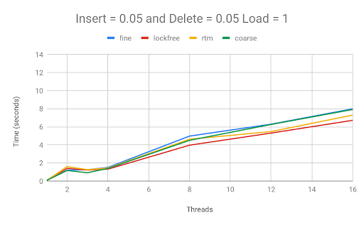
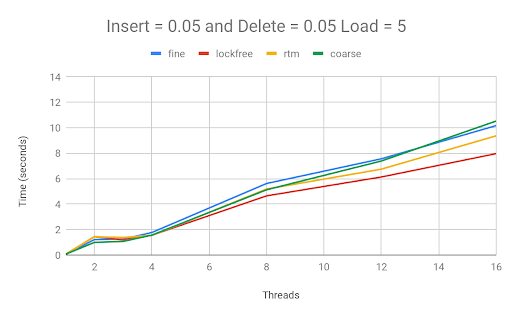
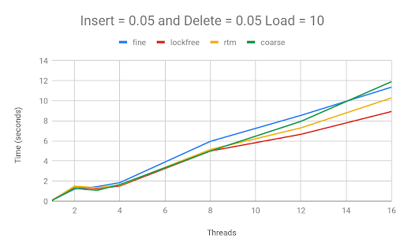

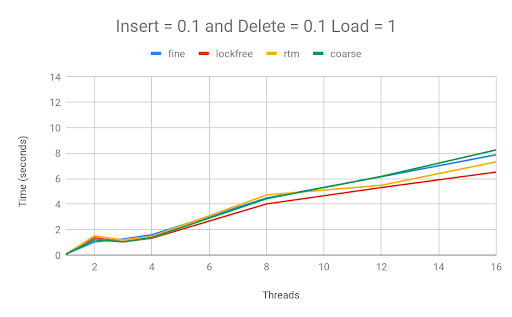
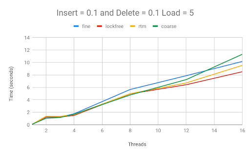
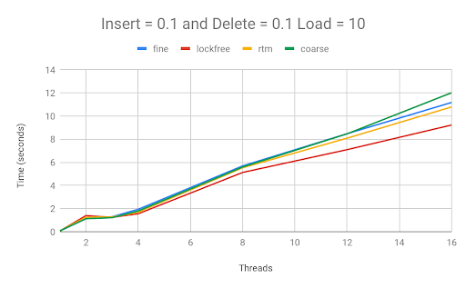

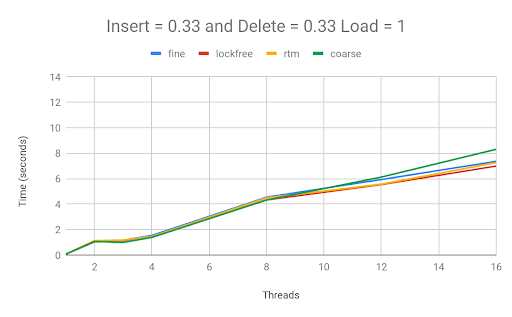
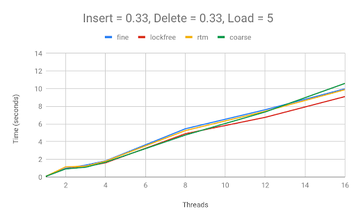
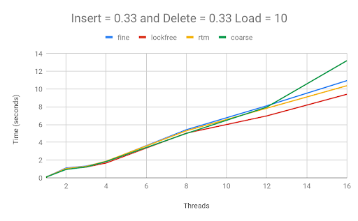

### Variation of number of threads
We observe that upon increasing the number of threads the time taken by each thread to complete 1 million operations increases almost linearly. This trend can be seen in all the settings of load factor. operation ratios and for all versions of the hash table. Ideally, we would have liked to see a slope of 0 but as the number of threads increase, the operations of one thread have an impact on the control flow of other threads. For instance, in the case of fine-grained if multiple threads are vying for the lock on the same bucket, only one of the them can acquire the lock and the others end up waiting. In the case of lock-free, suppose a node has to be inserted after a flagged node. Then the successor of the flagged node has to first be deleted before the insert can take place. What essentially happens is that threads end up doing the incomplete work of other threads and this takes up more time. Additionally, compare and swap while loops are common in lock-free programming and under high contention these may have to repeat many times before the operation succeeds. These could be some of the potential reasons for the degrading performance with increase in number of threads. Among the different versions, the lock-free version has the smallest slope among the rest, followed by rtm. This is because the lock based implementations incur the overhead of waiting for locks and acquiring them. Whereas, rtm uses locks only in the fallback path. Also, the extra work done by the lock-free implementation in updating the flag and mark bits and completing pending deletions of other threads proves to be cheaper than using locks. We also notice an increase in disparity between lockfree and the rest as we increase the number of threads which we attribute to the amplification of the above-mentioned effects. An unexpected observation is that coarse-grained is better than fine-grained in many settings till we use 16 threads. We think this may be because of the fact that more locks are passed around in the interconnect and this tends to outweigh the benefits of using fine-grained locks till the number of threads increase significantly to degrade the performance of coarse-grained severely.

### Variation of load factor
As the load factor grows, the list of keys associated with each each bucket increases. This means that the contention for a bucket also increases as many keys now map to the same bucket. We observe that rtm’s performance becomes more and more similar to lockfree as we reduce the load factor. This trend is expected because as the load factor reduces, contention also reduces. This in turn reduces the chance of transaction aborts. Under high contention rtm is similar to fine-grained because it uses the fine-grained as a fall-back. We also see that the difference between lock-free and coarse-grained increases as we increase the load factor. For example, when insert and delete ratios are 5%, the difference at load factor 1 is 1.2 seconds, at load factor 5 is 2.5 seconds and at load factor 10 is 2.8 seconds. This strongly suggests the inferiority of lock based implementations under high contention. Firstly, the interconnect traffic worsens and secondly, the amount of idle time also increases. 

### Variation of operation ratio
We vary the ratio of operations to understand the effect of percentage of read and writes on the hash table. As is expected, we do not expect much variation in the performance of coarse-grained and fine-grained with varying ratios of read and writes, since we use mutex locks and not reader-writer locks as in [4]. We did expect some noteworthy variation of rtm performance since the number of aborts could potentially reduce if all transactions are only reading memory locations and not writing to them. But it turns out that this is not the case and the performance is fairly consistent with varying ratio of insert, delete and search. In order to investigate this further we measured the percentage of aborts for the different operation ratios. The table below summarizes our findings, reported in an average over 16 threads.

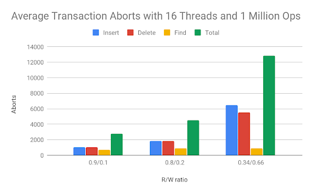

As we expected, the number of aborts significantly increases with the increase in the ratio of writes. But we did not observe commensurate differences in the total execution time. The reason for this is as follows. The total number of aborts we see for a R/W ratio of 0.34/0.66 is 12878. This is relatively high compared to the other settings but this is only 1.28% of the total number of operations each thread is performing. So we reason that the time taken to execute the remaining 99% of the successful transactions is far more than any additional overhead incurred due to aborting a transaction and executing the fallback path. This explanation effectively reconciles what we expected in theory and what we observe in practice.

## Conclusion
We can see from our project that fine-grained locking is not always better than having one big lock over the entire data structure, due to all the excess interconnect traffic generated. Similarly, restricted transactional memory definitely has a good amount of overhead with it. On the other hand, we found lock free data structures to be superior to the locked and transactional data structures, but definitely found that lock free data structures are much more difficult to implement.

<a href="project_proposal.pdf">View Proposal Here</a>

<a href="checkpoint_report.pdf">View Checkpoint Here</a>

<a href="final_report.pdf">View Final Report Here</a>

